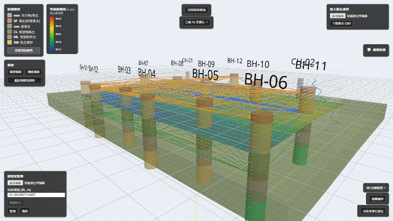
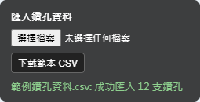
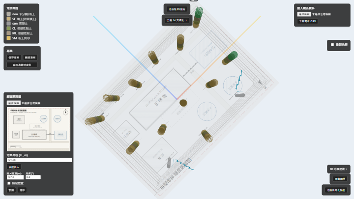
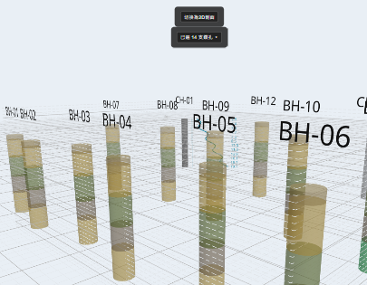
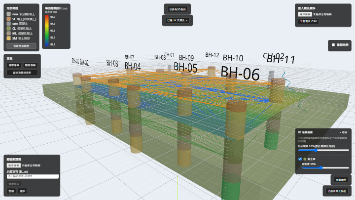
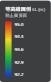
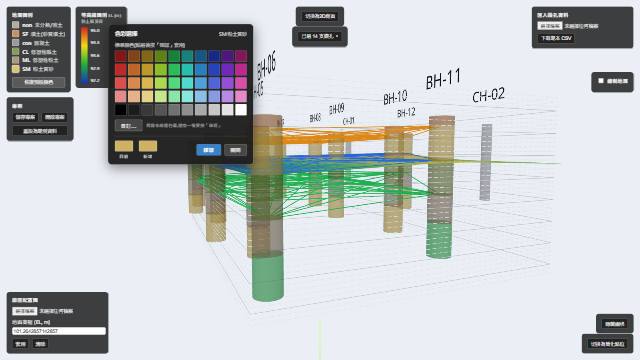
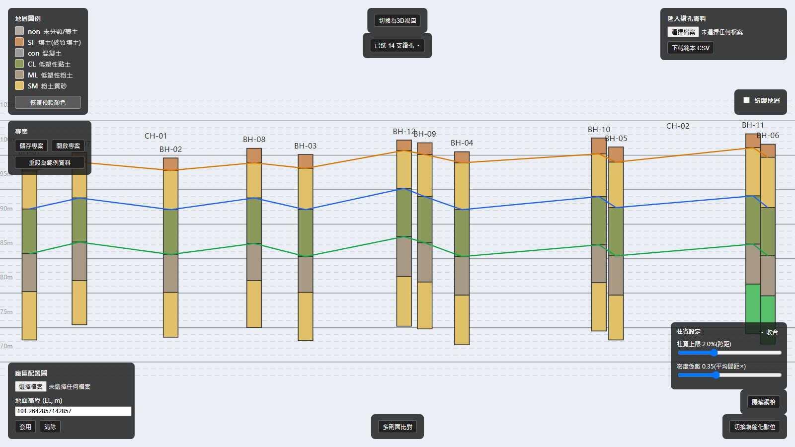
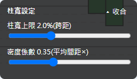
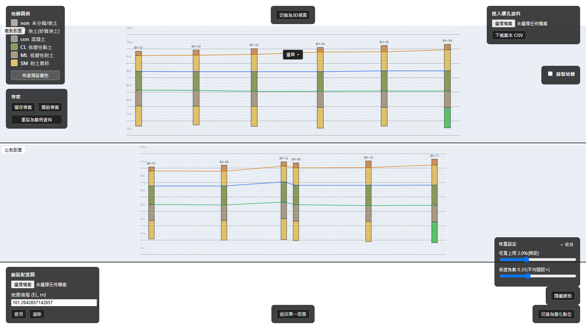

# 鑽孔柱狀圖 3D 視覺化工具

把地質鑽孔資料(座標、地表高程、地層分層、SPT-N/RQD/CPT)畫成互動式 3D 柱狀圖,可疊加真實廠區配置圖做空間比對,並支援手動繪製地層剖面線、3D 地層等高線曲面、3D 實體地層建模、2D 傳統剖面圖檢視與多剖面比對、專案存讀。瀏覽器端執行,不需要伺服器/資料庫。



**[線上 Demo](https://bensonhualien-bit.github.io/borehole-3d-viewer/)** · **[功能視覺導覽](https://bensonhualien-bit.github.io/borehole-3d-viewer/features.html)**

## About

**Borehole 3D Viewer** is a browser-based 3D/2D visualization tool for geotechnical borehole logs. Import borehole data from CSV/Excel, view soil layers as interactive 3D columns at real-world coordinates, overlay site plans, draw stratum boundary profiles, interpolate 3D layer contour surfaces (TIN / Ordinary Kriging), build translucent 3D solid stratum blocks between boundary surfaces, inspect traditional 2D cross-sections with multi-profile comparison, and export A3 PDF drawings. No server required — everything runs in your browser. **[Live demo](https://bensonhualien-bit.github.io/borehole-3d-viewer/)** · Docs are in Traditional Chinese.

## 線上 Demo

直接開啟 <https://bensonhualien-bit.github.io/borehole-3d-viewer/>,不需安裝任何軟體;打開就會看到內建的範例鑽孔場景。

想快速看到大部分功能同時運作的樣子,建議從畫面左上角「專案」面板按「開啟專案」,載入本 repo 內的 [`examples/範例專案.json`](examples/範例專案.json)——一份已經畫好 3 條剖面線、黏土層地層群組(含開啟的 3D 半透明實體)、Kriging 彩色等高線、自訂顏色與南側/北側比對群組的完整專案。

## 快速開始

需要 Node.js **20.19 以上或 22.12 以上**(Vite 8 的要求)。

```bash
git clone https://github.com/bensonhualien-bit/borehole-3d-viewer.git
cd borehole-3d-viewer
npm install
npm run dev      # 啟動開發伺服器(http://localhost:5173/)
```

> 相依套件 `xlsx` 因安全性修正改從 SheetJS 官方 CDN 安裝(npm registry 上的版本已停更且有已知 CVE),`npm install` 需要能連上 `cdn.sheetjs.com`;若在受限網路環境安裝失敗,請確認 proxy 允許該網域。

## 功能總覽

### 資料匯入與顯示



- **鑽孔資料匯入**:支援 CSV 與 Excel(.xlsx)兩種格式(依副檔名自動判斷),中/英文欄名都吃,CSV 支援 Big5/UTF-8 自動偵測,可下載空白範本,單筆資料錯誤不會中斷整批匯入。Excel 匯入額外支援 SPT-N、RQD、CPT 貫入曲線等鑽探量測資料
- **3D 鑽孔柱狀圖**:依真實座標與地表高程,把每支鑽孔的分層畫成可旋轉/縮放的 3D 柱子,座標方位跟真實地理南北一致,可以直接跟廠區平面圖對照;滑鼠移到分層上會顯示土質、深度範圍、備註;有 SPT-N/RQD 量測值的鑽孔會額外顯示對應深度的數值標籤;CPT 測點顯示為半透明灰柱 + 常駐 qc 貫入曲線(全場統一比例尺、負值以紅色「0」標示),曲線同樣出現在 2D 剖面與匯出 PDF,也可在曲線上點選分層點
- **地層圖例**:列出目前土質代碼對應的顏色與中文名稱
- **鑽孔顯示模式切換**:可在「完整柱狀圖」與「簡化點位」間切換,適合鑽孔數量多、只想看分布位置的情境
- **廠區配置圖疊加**:兩種放置方式——「兩點校準」(點選 2 個已知座標參考點,自動算出縮放/旋轉/位置)或「快速插入」(輸入高程後圖片跟著滑鼠、點擊放置);放置後可拖曳平移、右下角把手縮放+旋轉、面板寬度/角度欄精確輸入,支援鎖定位置,校準結果存在瀏覽器本機


- **高程參考網格**:3D(垂直網格牆)與 2D 剖面圖(水平參考線)都有,5m 為主線、1m 為次線



### 地層剖面線繪製

- **手動繪製剖面線**:在 3D 場景中依序點選不同鑽孔柱子上的深度位置,連成一條命名、可自訂顏色的剖面線;深度可選「吸附地層界面」或「自由深度」(精度 0.01m)模式,點選/拖曳時即時顯示深度數字
- **線編輯**:可繼續加點、刪除單一點、拖曳既有點調整深度
- **地層(岩層)群組**:選取兩條邊界線(頂/底)並命名、選色,組成一個「地層」

### 3D 地層等高線

- **等高線曲面**:任一條已命名的邊界線只要有 3 個以上不共線的點,就能開啟等高線,把這條線內插成依真實高程起伏的 3D 曲面並疊加等值線
- **內插演算法**:可全域切換「TIN」(Delaunay 三角網,只在鑽孔涵蓋範圍內產生結果、不外插)與「Kriging」(Ordinary Kriging,可外插,變異函數參數可自動擬合或手動覆寫)
- **顯示模式**:純線段(預設)或依高程漸層上色,等高線間距可自訂

### 3D 地層建模(實體地層塊)



- **實體地層塊**:已指定頂/底界兩條邊界線的「地層」,可在 3D 場景右下角「3D 地層建模」面板一鍵變成有厚度的半透明 3D 實體——頂/底界面各自內插成曲面後封閉成塊,幾何含側面裙邊,多個地層與鑽孔柱可同時透視檢視
- **每地層獨立控制**:各自的顯示開關與透明度滑桿(10%~100%)
- **內插法跟隨等高線全域設定**:Kriging(含手動變異函數參數)或 TIN 完全沿用等高線的設定,實體與等高線曲面在鑽孔涵蓋範圍內同值、疊圖可對齊;TIN 模式的實體外插採「邊界值平推」,等高線曲面本身維持不外插
- **外插範圍可調**:以鑽孔分布對角線的百分比往外延伸(0~30%,預設 10%)
- **尖滅處理**:內插出「頂界低於底界」的區域厚度自動歸零收斂(不畫翻面),面板顯示尖滅比例提示
- 相鄰地層可共用同一條邊界線,實體在交界面天然貼合無縫;所有建模設定跟著 localStorage 與專案檔存讀

### 等高線數值圖例



有剖面線同時開著「等高線」與「有上色」時,畫面左上角會出現對應的縱向漸層色條圖例,標示目前線段的高程數值範圍,切換演算法或參數時即時更新。

### 土壤顏色自訂



點地層圖例上的色塊即可跳出色彩選擇對話框(50 色標準色盤 + 系統色彩選擇器自訂),換色會同步套用到 3D 柱狀圖、2D 剖面、圖例三處;顏色設定會存進瀏覽器,也會跟著專案檔一起存讀。

### 2D 剖面圖檢視



與 3D 場景切換,重用同一份剖面線資料;兩種水平軸距離模式(投影剖面距離 / 鑽孔間直線距離);支援滾輪縮放、右鍵拖曳平移;準備新增/拖曳點時即時顯示深度數字。

### 柱寬設定



可調整 2D 柱狀寬度上限與密度係數,同時套用在螢幕顯示與匯出 PDF;位置太接近的鑽孔會自動並排錯開,避免柱子擠成一片。

### 2D 剖面匯出 PDF

A3 橫式頁面,含圖框、圖名欄、圖例、雙側高程軸與剖面圖本身;縱向依資料形狀自動放大倍率;多剖面比對匯出時每個鑽孔群組各自成一頁,合成一份多頁 PDF。範例成品:[`docs/images/範例剖面匯出.pdf`](docs/images/範例剖面匯出.pdf)。

### 多剖面比對



可建立多組「鑽孔群組」,各自畫成一張剖面圖由上而下堆疊顯示;各面板可獨立縮放/平移(垂直與水平方向皆各自獨立);面板完全可互動,剖面線資料全域共用,同一支鑽孔出現在多個群組時編輯會自動同步。

### 專案存讀

可把目前的鑽孔資料、廠區配置圖校準、剖面線資料、等高線設定、3D 地層建模設定、自訂顏色、柱寬設定整包存成一個 `.json` 專案檔下載,之後開啟即可一次還原所有資料與畫面設定;匯入/開啟過的資料會留在瀏覽器 localStorage,重新整理不會消失,面板上也有「重設為範例資料」按鈕可一鍵清空回到內建範例場景。

## 資料格式

### CSV(九欄)

| 欄位 | 說明 |
|---|---|
| 鑽孔名稱 | 鑽孔代號 |
| X座標 | 平面座標 X |
| Y座標 | 平面座標 Y |
| 地表高程 | 地表高程(m) |
| 頂深 | 該分層頂部深度(m) |
| 底深 | 該分層底部深度(m) |
| 岩性 | 土質/岩性描述或代碼 |
| 顏色 | 選填,留空則依土質名稱自動配色 |
| 備註 | 選填 |

範例:[`examples/範例鑽孔資料.csv`](examples/範例鑽孔資料.csv)(12 支鑽孔)。

### Excel(.xlsx,五個工作表)

| 工作表 | 欄位 |
|---|---|
| 鑽探資料 | 孔號、類型(BH 或 CPT)、X 座標(mm)、Y 座標(mm)、地表高程(m) |
| 土層 | 孔號、頂深、底深、互層(0 或 1)、主層、副層 |
| SPTN | 孔號、試驗編號、頂深、底深…(N 值在第 11 欄) |
| RQD | 孔號、頂深、底深、RQD(%) |
| CPT | 每支孔一對欄位(深度/qc),第 3 列起為資料 |

範例:[`examples/範例鑽探報告.xlsx`](examples/範例鑽探報告.xlsx)(14 支鑽孔:12 支 BH + 2 支 CPT,含 SPT-N/RQD/CPT)。

### 專案檔

範例:[`examples/範例專案.json`](examples/範例專案.json) — 完整專案存檔,見上方「線上 Demo」一節說明。

## 回饋方式

歡迎透過 [GitHub Issues](https://github.com/bensonhualien-bit/borehole-3d-viewer/issues) 回報 bug 或提出功能建議,開新 Issue 時可選擇 Bug report / Feature request 範本。

## 開發

```bash
npm install
npm run dev      # 啟動開發伺服器(http://localhost:5173/)
npm run build    # 型別檢查 + 正式建置
npm test         # 執行單元測試(vitest)
npm run lint     # oxlint
```

> `scripts/` 內的 `debug-e2e-*.mjs` 為開發用 Playwright 除錯腳本:`debug-e2e-examples.mjs` 只用 `examples/` 範例檔,clone 後即可執行;其餘腳本依賴未入庫的本機測試資料,在公開 repo 無法執行。`npm test` 單元測試開箱即跑,不受影響。

## 專案結構

```
src/
  types/borehole.ts         # Borehole / SoilLayer 資料型別
  data/mockBoreholes.ts     # 內建範例資料
  utils/
    csvImport.ts             # CSV 解析與驗證
    xlsxImport.ts             # Excel(.xlsx)解析(含 SPT-N/RQD/CPT)
    soilColors.ts             # USCS 土質代碼 → 顏色/名稱對照表
    sitePlanStorage.ts        # 廠區配置圖校準數學 + localStorage 存取
    sitePlanQuickInsert.ts    # 快速插入:placement ⇄ 校準點互轉、角落把手向量運算
    profileStorage.ts         # 剖面線/地層資料模型 + localStorage 存取
    profileAxis.ts            # 剖面線水平軸計算(投影距離 / 累加直線距離)
    depthSnap.ts               # 深度吸附(地層邊界 / 自由深度 0.01m)邏輯
    boreholeElevation.ts       # 鑽孔最大深度、高程網格範圍計算
    svgCoords.ts                # 2D 剖面圖 SVG 座標轉換、縮放
    zoom.ts                      # 2D 剖面圖縮放邏輯
    projectFile.ts               # 專案存讀(.json)打包/還原
    contour/
      types.ts                     # KnownPoint / Interpolator 介面
      delaunayInterpolator.ts       # TIN(Delaunay 三角網)+ 線性內插實作
      variogram.ts                    # 球形變異函數模型 + 自動擬合 range/sill/nugget
      krigingSolver.ts                  # 高斯消去法解線性方程組(Kriging 用)
      krigingInterpolator.ts              # Ordinary Kriging 內插實作(可在凸包外外插)
      grid.ts                        # 內插查詢網格建構
      marchingSquares.ts              # Marching Squares 等值線抽取
      smoothing.ts                     # Chaikin 等值線曲線平滑
      colorScale.ts                     # 高程 → 顏色漸層
      contourSettings.ts                # 等高線設定(間距/顯示模式)+ localStorage 存取
      resolveContourPoints.ts            # 剖面線 → 內插用座標點轉換
    model/
      modelSettings.ts               # 3D 地層建模設定(外插比例/每地層開關與透明度)+ localStorage 存取
      solidGrid.ts                    # 地層實體取樣網格(頂/底兩面共用規格、尖滅歸零)
      tinExtrapolator.ts               # TIN 外插包裝層(凸包外邊界值平推,只給實體用)
  components/
    Scene.tsx                 # 3D 場景(相機、燈光、格線、高程網格)
    ContourSurface.tsx          # 3D 場景的地層等高線曲面渲染
    contourGeometry.ts            # 等高線曲面/等值線的 THREE.BufferGeometry 建構
    LayerSolid.tsx                 # 3D 實體地層塊渲染(半透明實體)
    layerSolidGeometry.ts           # 實體幾何建構(頂面/底面/側面裙邊)
    LayerModelPanel.tsx              # 3D 地層建模控制面板
    BoreholeColumn.tsx         # 單一鑽孔柱狀圖 + hover 提示 + 剖面點選
    BoreholePoint.tsx           # 簡化點位顯示的單一鑽孔
    SoilLegend.tsx               # 地層圖例面板
    DataUploader.tsx             # 鑽孔資料匯入面板(CSV/Excel)
    SitePlanPlane.tsx             # 廠區配置圖的 3D 貼圖平面(含拖曳/鎖定)
    SitePlanUploader.tsx          # 廠區配置圖上傳/校準/縮放/鎖定面板
    SitePlanPlacement.tsx         # 快速插入放置模式(半透明預覽跟隨滑鼠)
    DisplayModeToggle.tsx          # 完整柱狀圖/簡化點位 切換面板
    ProfileLines.tsx                # 3D 場景的剖面線繪製(完全圖連線)
    ProfileDrawer.tsx                # 剖面線清單/編輯/地層群組面板
    ProfileSection2D.tsx              # 2D 傳統剖面圖檢視(SVG)
    BoreholeChecklist.tsx              # 鑽孔可見度勾選清單(2D/3D 各自獨立使用)
    ViewModeToggle.tsx                  # 2D/3D 檢視切換按鈕
    ElevationGrid.tsx                    # 3D 高程參考網格(垂直網格牆)
    GridToggle.tsx                        # 顯示/隱藏網格開關
    ProjectManager.tsx                    # 專案存讀面板
```

更完整的操作說明請見[使用手冊](docs/使用手冊.md)。

## 授權

[MIT](LICENSE)
